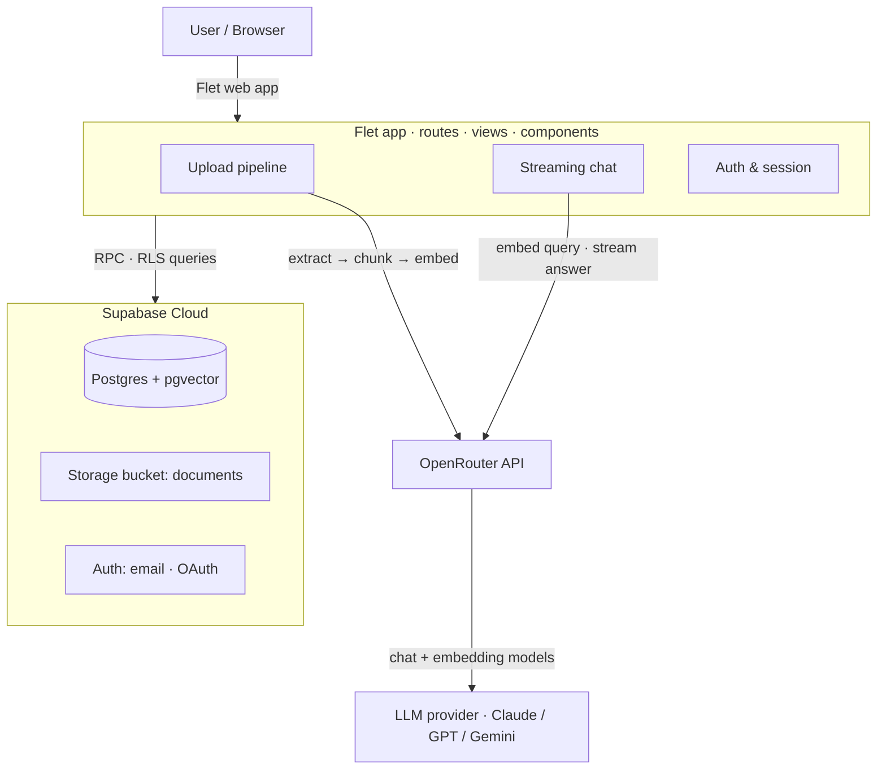

# EasyDocs AI

> Chat with your documents. Upload a PDF, Word file or plain text and get grounded, cited answers powered by a full Retrieval-Augmented Generation (RAG) pipeline.

<p align="left">
  <a href="https://easy-docs-ai.onrender.com/"><strong>🚀 Live Demo &nbsp;→&nbsp; easy-docs-ai.onrender.com</strong></a>
</p>

<p align="left">
  
  
  
  
  
  
</p>

---

## What it does

EasyDocs AI lets anyone drop in a document and start a conversation with it. Behind the simple upload box sits a complete RAG stack: text extraction, semantic chunking, vector embeddings, similarity search over **pgvector**, and a streaming LLM that answers **only** from the retrieved excerpts and cites its sources inline.

- **Sign in** to keep multiple chats, upload up to 3 documents per chat, and have everything persisted and searchable.
- **Or try it as a guest** — no account needed. The document stays in your browser and the LLM answers it directly using prompt caching.

## Highlights (the engineering, not the marketing)

- **End-to-end RAG built from scratch** — extract → chunk → embed → vector search → grounded, source-cited answer. No black-box framework.
- **Transactional, two-phase uploads with rollback** — all expensive work (extraction, chunking, embedding) happens in memory first; database and storage writes only follow once everything succeeds. A single Postgres function commits the document, its chunks, and the chat link atomically, and orphaned storage objects are cleaned up on any failure.
- **Content-addressed deduplication** — files are hashed with SHA-256, so re-uploading the same document reuses its existing embeddings instead of paying to re-embed it.
- **Security-first data model** — Row-Level Security on every table; the upload RPC runs `SECURITY INVOKER` and is scoped to `auth.uid()`, so users can only ever touch their own data.
- **Streaming chat with cancel** — tokens render as they arrive, with a stop button that aborts generation mid-stream.
- **Guest mode** — works with zero backend state using browser `localStorage` and Anthropic-style ephemeral **prompt caching** to keep guest queries cheap.
- **Full auth suite** — email/password, email confirmation, password reset, Google OAuth, and resilient session restore that silently refreshes Supabase tokens on load.
- **One codebase, every platform** — built on Flet (Flutter under the hood), so the same Python UI can ship to web, desktop, iOS and Android.
- **Responsive by design** — distinct mobile / tablet / desktop layouts driven by runtime breakpoints.

## Architecture



### Request flow

**Upload**
1. File is read client-side and validated (type + size limit; smaller cap for guests).
2. Text is extracted (`pypdf` / `python-docx` / UTF-8) and split into overlapping, separator-aware chunks (~1500 chars, 200 overlap).
3. Each chunk is embedded via OpenRouter (2048-dim vectors).
4. The original file is stored in Supabase Storage under a content-addressed path (`{user}/{sha256}.{ext}`).
5. A single `upload_document_atomic` Postgres function inserts the document, all chunks, and the chat link in one transaction.

**Chat**
1. The user's question is embedded.
2. `match_document_chunks` runs a pgvector similarity search scoped to the chat and returns the top 4 chunks.
3. Retrieved excerpts are assembled into a grounded system prompt that instructs the model to answer only from the sources and cite filenames inline.
4. The answer is streamed token-by-token and persisted to the `messages` table (or `localStorage` for guests).

## Tech stack

| Layer | Technology |
|---|---|
| **UI / Frontend** | [Flet](https://flet.dev) 0.81 (Flutter-powered Python UI, compiled to web) |
| **Language** | Python 3.11 |
| **LLM & Embeddings** | [OpenRouter](https://openrouter.ai) (OpenAI-compatible) — streaming chat + embeddings |
| **Database** | Supabase Postgres + **pgvector** for similarity search |
| **Storage** | Supabase Storage (content-addressed document bucket) |
| **Auth** | Supabase Auth — email/password, email confirmation, password reset, Google OAuth |
| **Packaging** | [uv](https://github.com/astral-sh/uv) for dependency management |
| **Container** | Docker (`python:3.11-slim`) |
| **Hosting** | [Render](https://render.com) (app) + Supabase Cloud (backend) |

## Data model

Five tables, all protected by Row-Level Security:

- **`documents`** — file metadata, status enum (`uploading` / `ready` / `failed`), SHA-256 hash, size constraint (≤ 5 MB), unique per `(user, hash)`.
- **`document_chunks`** — chunk text + `vector(2048)` embedding, unique per `(document, chunk_index)`.
- **`chats`** — conversation threads with auto-bumped `updated_at`.
- **`chat_documents`** — many-to-many junction; deleting a chat cascades and garbage-collects orphaned documents + their storage objects.
- **`messages`** — `user` / `ai` turns with length constraints and a JSONB metadata column.

Custom Postgres functions: `upload_document_atomic` (transactional ingest) and `match_document_chunks` (vector search). Migrations live in [`supabase/migrations/`](supabase/migrations/).

## Project structure

```
src/
├── main.py                 # entry point — boots the Flet web app
├── app/App.py              # app bootstrap: theme, session restore, router wiring
├── routes/                 # client-side routing
├── views/                  # pages: home, chat, login, register, auth flows…
├── components/             # UI: upload card, chat drawer, hero, app bar, messages…
└── utils/
    ├── supabase.py         # all DB / storage access (queries + RPCs)
    ├── session.py          # auth session persistence & restore
    ├── config.py           # theme, limits, breakpoints
    └── ai/
        ├── extract.py      # PDF / DOCX / TXT → text
        ├── chunk.py        # separator-aware chunking with overlap
        ├── openrouter.py   # chat (streaming) + embedding clients
        └── rag.py          # prompt building & retrieval orchestration
supabase/migrations/        # SQL schema, RLS policies, vector functions
Dockerfile                  # production container for Render
```

## Running locally

### Prerequisites
- Python 3.11+
- [uv](https://github.com/astral-sh/uv)
- A Supabase project and an OpenRouter API key

### Environment

Create a `.env` file:

```env
SUPABASE_URL=...
SUPABASE_KEY=...
OPENROUTER_API_KEY=...
OPENROUTER_CHAT_MODEL=...        # any OpenRouter chat model
OPENROUTER_EMBED_MODEL=...       # an embedding model producing 2048-dim vectors
OPENROUTER_SITE_URL=             # optional
OPENROUTER_APP_NAME=EasyDocs-AI  # optional
```

Apply the SQL in `supabase/migrations/` to your Supabase project (requires the `vector` extension enabled).

### Start the app

```bash
uv run flet run --web
```

## Deployment

The app ships as a **Docker** container and runs on **Render**, with **Supabase Cloud** as the backend.

```dockerfile
FROM python:3.11-slim
# uv installs locked deps, then the app is served over the web
CMD ["sh", "-c", "uv run flet run --web --host 0.0.0.0 --port ${PORT} src/main.py"]
```

On Render: connect the repo, let it build from the `Dockerfile`, and set the environment variables above. Supabase URL/key and OpenRouter credentials are injected as Render env vars — no secrets in the image.

## Build for other platforms

Because it's built on Flet, the same code can be packaged for desktop and mobile:

```bash
flet build macos   # or windows / linux / apk / ipa
```

See the [Flet packaging guides](https://docs.flet.dev/publish/) for signing and platform specifics.

---

<p align="left"><em>Built with Python, Flet, Supabase and a hand-rolled RAG pipeline.</em></p>
